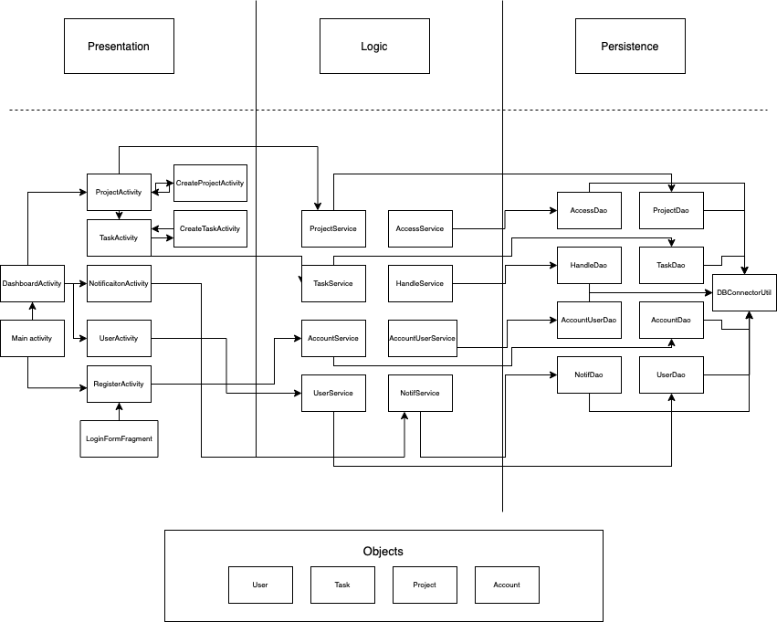

### Architecture:

We divide our application into 3-tier architecture. There are 6 main java packages:  'application', 'business', 'objects', 'persistence', 'presentation'.

## Domain-Specific Object

- Project
- Task
- User
- Account

## Presentation Layer

- MainActivity
- DashboardActivity
- ProjectActivity
- TaskActivity
- NotificationActivity
- UserActivity
- RegisterActivity
- LoginFormFragment
- CreateProjectActivity
- CreateTaskActivity

## Business Layer

- ProjectService 
- TaskService
- AccountService
- UserService
- AccessService
- HandleService
- AccountUserService
- NotifService

## Persistence Layer

- HandleDao
- AccounterUserDao
- NotifDao
- ProjectDao
- TaskDao
- AccountDao
- UserDao
- HandleImp
- AccounterUserImp
- NotifImp
- ProjectImp
- TaskImp
- AccountImp
- UserImp

