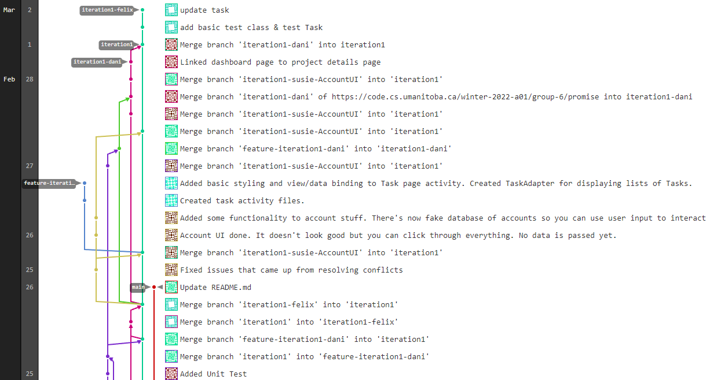

Iteration 1 Worksheet
=====================

Adding a feature: Manage Project
-----------------

As all of the tasks in our application will be tied to a *Project* that a user is a part of, the 'Manage Project' functionality has been given a high priority from the beginning. Users can build a project and invite others to join it, or they can send join requests to other projects.

Our team's initial plan was to implement all user stories related to this feature, but we have decided to push user stories for Project invites/join requests to the next iteration, and only implement the developer tasks for 'Create Project'. Our team made this choice as we wanted to ensure that our project and user classes had a solid basis before introducing features that would integrate both.

The 'Create Project' user story was broken into many tasks, as creating a project involves viewing all created projects and details of one particular project.

Links to user stories, merge requests, merge commits and tests can be found bellow.

[Manage Project Feature](https://code.cs.umanitoba.ca/winter-2022-a01/group-6/promise/-/issues/5)
* User Stories
    * Iteration 1
        * [Create Project](https://code.cs.umanitoba.ca/winter-2022-a01/group-6/promise/-/issues/4)
    * Iteration 2
        * [Send Project Invites](https://code.cs.umanitoba.ca/winter-2022-a01/group-6/promise/-/issues/20)
        * [Respond to Join Request](https://code.cs.umanitoba.ca/winter-2022-a01/group-6/promise/-/issues/27)
        * [Respond to Project Invite](https://code.cs.umanitoba.ca/winter-2022-a01/group-6/promise/-/issues/28)
* Merge Requests & Commits
    * [Project Feature](https://code.cs.umanitoba.ca/winter-2022-a01/group-6/promise/-/merge_requests/6)
    * [Updated projects](https://code.cs.umanitoba.ca/winter-2022-a01/group-6/promise/-/merge_requests/11)
* Tests for Projects
    * [All tests including tests for Projects](https://code.cs.umanitoba.ca/winter-2022-a01/group-6/promise/-/tree/iteration1/app/src/test/java/comp3350/group6/promise/tests)

Exceptional code
----------------
[Test for exceptional code](https://code.cs.umanitoba.ca/winter-2022-a01/group-6/promise/-/blob/iteration1/app/src/test/java/comp3350/group6/promise/tests/business/ProjectServiceTempDBTest.java) 

If a project that has an empty name (""), then trying to insert that project in the database through the [ProjectService(business)](https://code.cs.umanitoba.ca/winter-2022-a01/group-6/promise/-/blob/iteration1/app/src/main/java/comp3350/group6/promise/business/ProjectService.java) class will throw an exception to the caller.
This can be seen in the [AddProjectActivity.java](https://code.cs.umanitoba.ca/winter-2022-a01/group-6/promise/-/blob/iteration1/app/src/main/java/comp3350/group6/promise/presentation/AddProjectActivity.java) file, that is trying to handle this exception by showing an error message to the user.
This exception was created since we want to prevent users from having empty fields.

Branching
----------
Our branching strategy can be found in our [README.md](./README.md).

From this image, nothing has merged into the main branch yet, but it can be seen that all the development was done on each member's branch and was merged into the iteration1 branch.

SOLID
-----

On *March 02 3:30 PM*, Group 7 has not made any significant updates on their program, and only had `MainActivity.java`.

Hence, our team was not able to find any SOLID validations, and did not create any issues.

Agile Planning
--------------

Changes were made to the user stories that had to do with sending requests to join projects,
sending invites to other users, and responding to these requests. Major changes were also seen with our database.

Most of the time spent on the user stories dealing with requests and invites went into the  presentation layer. When it came time to have the code actually functional behind the scenes,
I had a hard time wrapping my head around the logic of how it would work without having
accounts and projects to work with.
Soon after reading week, we realized that not every feature in iteration 1 needed to have the presentation layer fully working with the logic layer.
A lot of time was wasted trying to think about the presentation and logic layers
together when I could have been testing the logic layer independently. This really highlighted how important low coupling in your code is.

Although none of the back end work for the user stories mentioned here are fully functional,
the presentation layer for the user story "[Send Project Invites](https://code.cs.umanitoba.ca/winter-2022-a01/group-6/promise/-/issues/20)" is basically finished, so
in future, I think it might make sense to separate user stories for the presentation layer
and the logic layers somehow.

Finally, you can also see that a lot of time was spent on building the database, only for us to switch to implementing fake databases using ArrayLists later on.

### Links

[Iteration 2 page](https://code.cs.umanitoba.ca/winter-2022-a01/group-6/promise/-/issues?milestone_title=Iteration+2)

[Respond to Project Invite](https://code.cs.umanitoba.ca/winter-2022-a01/group-6/promise/-/issues/28)

[Respond To Join Request](https://code.cs.umanitoba.ca/winter-2022-a01/group-6/promise/-/issues/27)

[Send Project Invites](https://code.cs.umanitoba.ca/winter-2022-a01/group-6/promise/-/issues/20)

[Respond to Project Request](https://code.cs.umanitoba.ca/winter-2022-a01/group-6/promise/-/issues/13)
